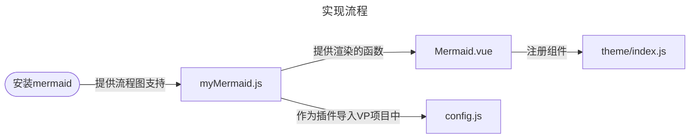

## 1. 集成 ElementPlus

!img[ElementPlus](elementplus)

::: info 
**ElementPlus** 是 **vue** 生态中非常出名的组件库，实际开发中，它经常被用来了开发一些后端管理页面。  
:::
> https://element-plus.org/zh-CN/ 

---


### 1.1 安装依赖包


```shell [npm]
npm install element-plus --save
```

### 1.2 配置代码 

> 找到 vitepress 项目的配置文件，然后修改对应代码。
> **配置文件**： `docs/.vitepress/theme/index.js` 👈    


```js [说明版]
import { h } from 'vue'
import DefaultTheme from 'vitepress/theme'
// ⭐1. 导入 elementplus 
import ElementPlus from 'element-plus'
// ⭐2. 导入 elementplus 的样式
import 'element-plus/dist/index.css'
export default {
  extends: DefaultTheme,
  enhanceApp({ app }) {
    // ⭐3. 注册 elementplus
    app.use(ElementPlus)
  },
}
```
::: warning 提示

因为是全局注册，你可以直接在项目中的 `vue` 文件中使用

:::


### 1.3 使用配套图标（可选）

::: info 
ElementPlus 的图标是可选的，不是必须集成的，根据自己需求是否集成它。
:::


- 安装图标依赖包 

> 注意图标是单独的包，所以要另外安装它

```shell [npm]
npm install @element-plus/icons-vue
```

- 配置代码 

```js [说明版]
import { h } from 'vue'
import DefaultTheme from 'vitepress/theme'
//  1. 导入 elementplus 
import ElementPlus from 'element-plus'
//  2. 导入 elementplus 的样式
import 'element-plus/dist/index.css'
// ⭐ 4. 导入 elementplus-icon
import * as ElementPlusIconsVue from '@element-plus/icons-vue'
export default {
  extends: DefaultTheme,
  enhanceApp({ app }) {
    // 3. 注册 elementplus
    app.use(ElementPlus)
    // ⭐ 5. 注册 elementplus 图标
    for (const [key, component] of Object.entries(ElementPlusIconsVue)) {
      app.component(key, component)
    }
  },
}
```

-=-

## 2. 集成图片预览

::: info
使用 `medium-zoom` 实现，这个办法比较简单，只需要在安装依赖包后，配置两个主题文件即可：   
**theme\index.css** 和 **theme\index.js**
:::


---


<!-- |`维度`|`评分`|
|:---:|:---:|
|**快捷集成**| ❤❤❤❤🤍|
|**实用程度**| ❤❤❤❤🤍|
|**推荐指数**| ❤❤❤❤❤| -->


### 2.1 安装依赖

```shell
npm i medium-zoom
```

---

### 2.2 添加样式

文件位置：`\.vitepress\theme\index.css`

```css
.medium-zoom-overlay {
  z-index: 20;
}
.medium-zoom-image {
  z-index: 21;
}

```

---

### 2.3 配置代码

> 有两种可选的配置方法：**全局生效** （推荐） 和 **部分生效** 

文件位置： `\.vitepress\theme\index.js`


- 1️⃣ 全局生效

```js 
import DefaultTheme from 'vitepress/theme'
import { onMounted, watch, nextTick } from 'vue'
import { useRoute } from 'vitepress'
import mediumZoom from 'medium-zoom'
import './index.css'

export default {
  ...DefaultTheme,
  setup() {
    const route = useRoute()
    const initZoom = () => {
        // 1. 【选择一】对全局图片生效
        // ❌警告：如果你自定义了vitepress主题布局，可能会缺失 .main 类名，
        // 所以根据你的实际布局类名来填写，
        // 如果你不懂上述的话，且运行后项目并未实现放大功能
        // 请将 '.main img' 改为 'img' 或许能够解决你的问题
      mediumZoom('.main img', { background: 'var(--vp-c-bg)' })
    };
    onMounted(() => {
      initZoom()
    })
    watch(
      () => route.path,
      () => nextTick(() => initZoom())
    )
  }
}
```

- 2️⃣ 特定生效

```js 
import DefaultTheme from 'vitepress/theme'
import { onMounted, watch, nextTick } from 'vue'
import { useRoute } from 'vitepress'
import mediumZoom from 'medium-zoom'
import './index.css'

export default {
  ...DefaultTheme,
  setup() {
    const route = useRoute()
    const initZoom = () => {
        // 2. 【选择二】对具有特定css类名的图片生效（ 见后文提示 ）
      mediumZoom('[data-zoomable]', { background: 'var(--vp-c-bg)' })
    };
    onMounted(() => {
      initZoom()
    })
    watch(
      () => route.path,
      () => nextTick(() => initZoom())
    )
  }
}
```
> 局部生效，即是这样配置生效的图片

```md
{data-zoomable}

<!-- 在基本的图片语法后加上 {data-zoomable}  即可-->

<!-- 考虑到和别的项目冲突，建议用全局的，省事，还不用特意去记-->
```


### 2.4 演示效果

::: info 提示
**当鼠标指针悬浮在图片上时，会显示放大镜，然后可放大**
:::


### 2.5 踩坑点

::: warning 提示

在重构我的 **vitepress** 博客后，我放弃了它的默认布局，基本上重写了项目中的每一个的组件，当我利用 `mediumZoom` 重新实现新博客的放大功能时，发现放大功能无法生效，**排错后，发现是因为重写组件后我的博客没有了`.main`这个类名，这导致原来的配置失效。** 所以，如果你出现了同样的问题，可以在自己的布局组件中合适位置加上 `.main`，  或者将 **'.main img'** 替换为自己的布局类名，例如 **'.myDoc img'** ，亦或者直接让全部图片生效，将 `'.main img'` 替换为 `'img'` 。   
简单来说，**mediumZoom()** 函数的第一个参数，是它的作用域。

:::


```js
// 省略...
export default {
  ...DefaultTheme,
  setup() {
    const initZoom = () => {
    // 省略...
      mediumZoom('.main img', { background: 'var(--vp-c-bg)' })
    };
   // 省略...
  }
}
```

## 3. 隐藏外链自带的箭头

::: info 
**vitepress** 中 **外链** 会自带的箭头，我们可以通过覆盖css样式，去除预设的链接样式
:::

> 在主题样式的 CSS 文件中加入下面代码   
> （ 我项目的路径被我重构过，不用管，**只要写在全局样式的文件中就行** ）  

`文件路径`：`\.vitepress\theme\style\index.scss`   

```css 
:is(.vp-external-link-icon, .vp-doc a[href*='://'], .vp-doc a[target='_blank']):not(.no-icon)::after {
    display: none;
}
```


- 补充信息

原始样式的路径地址：  

`\node_modules\vitepress\dist\client\theme-default\styles\components\vp-doc.css`  


相关组件的路径地址：  

`\node_modules\vitepress\dist\client\theme-default\components\VPLink.vue`

```css
/* 原来的样式如下 */

/**
 * External links
 * -------------------------------------------------------------------------- */

/* prettier-ignore */
:is(.vp-external-link-icon, .vp-doc a[href*='://'], .vp-doc a[target='_blank']):not(.no-icon)::after {
  display: inline-block;
  margin-top: -1px;
  margin-left: 4px;
  width: 11px;
  height: 11px;
  background: currentColor;
  color: var(--vp-c-text-3);
  flex-shrink: 0;
  --icon: url("data:image/svg+xml, %3Csvg xmlns='http://www.w3.org/2000/svg' viewBox='0 0 24 24' %3E%3Cpath d='M0 0h24v24H0V0z' fill='none' /%3E%3Cpath d='M9 5v2h6.59L4 18.59 5.41 20 17 8.41V15h2V5H9z' /%3E%3C/svg%3E");
  -webkit-mask-image: var(--icon);
  mask-image: var(--icon);
}

.vp-external-link-icon::after {
  content: '';
}

/* prettier-ignore */
.external-link-icon-enabled :is(.vp-doc a[href*='://'], .vp-doc a[target='_blank'])::after {
  content: '';
  color: currentColor;
}

```

## 4. 集成 pinia

**官网**：https://pinia.vuejs.org/zh/

### 4.1 安装依赖

```shell [pnpm]
pnpm install pinia
```

### 4.2 配置代码

在 `.vitepress/theme/index.js` 中设置 Pinia：

```js
import { createPinia } from 'pinia'
import DefaultTheme from 'vitepress/theme'

export default {
  extends: DefaultTheme,
  enhanceApp({ app }) {
    const pinia = createPinia()
    app.use(pinia)
  }
}
```


### 4.3 使用 

在 `.vitepress/stores/counter.js` 中创建示例 store：

```js
import { defineStore } from 'pinia'
export const useCounterStore = defineStore('counter', {
  state: () => ({ count: 0 }),
  actions: {
    increment() {
      this.count++
    }
  }
})
```

> 然后在组件中使用


```vue
<script setup>
import { useCounterStore } from '../.vitepress/stores/counter'
const counter = useCounterStore()
</script>

<template>
  <div>
    <p>Count: {{ counter.count }}</p>
    <button @click="counter.increment()">+1</button>
  </div>
</template>
```
### 4.4 持久化

- 安装持久化插件

```shell
npm install pinia pinia-plugin-persistedstate
```


---
category: 'tech'
tags: ['vitepress','vue','Giscus']
icon: 'vitepress'
cover: 'vitepress'

---


<br/>

## 5. 集成 评论区
 
### 5.1. 集成 Giscus 

**官网**： https://giscus.app/zh-CN

#### 5.1.1 在 Github 相关设置


- 在 **GitHub** 上 创建 或 拥有 一个基于 `vitepress` 构建的项目仓库

- 开启 **Github** 仓库的 **Discussions** 功能 

> 在仓库的 settings  -> General ->  **勾选 Discussions✅** 


- 安装 Giscus app 

> 在 Github 网页中安装 Giscus app （类似插件）  

**点击安装** ：https://github.com/apps/giscus  


- **进入页面安装**


- **根据自己情况，选择已建的 `vitepress` 的仓库，还是全部仓库**


- **后续，也可以通过 Github 网站中的设置随时修改  Giscus 的配置范围**


#### 5.1.2 在 giscus 获取配置参数 

- 获取配置参数

**`官网`**： https://giscus.app/zh-CN

**进入官网后填写配置**  

> **请注意：**  
> ① 仓库需要公开的  
> ② giscus app 已安装  
> ③ Discussions 功能已在仓库中启用。  


**配置完成后，会得到相关参数数据**  


#### 5.1.3 项目中创建评论组件

::: warning  常见错误

如果你出现页面空白的情形，把括号去掉，因为导入的是组件，不是函数。  

`import { Giscus } from '@giscus/vue'`  

换为👇

`import Giscus from '@giscus/vue'`  

:::


> 在 `.vitepress/theme/components` 目录下新建 `Comment.vue`：

```vue
<script setup>
import  Giscus from '@giscus/vue';
</script>

<template>
  <div class="comment-container">
    <ClientOnly>
        <!-- 根据实际生成的数据填写/ -->
        <!-- 组件中没有 data 的前缀，但是对应之前生成的参数 -->
      <Giscus
        repo="your-github/repo"
        repoId="your_repo_id"
        category="General"
        categoryId="your_category_id"
        mapping="pathname"
        input-position="top"
        reactionsEnabled="1"
        emitMetadata="0"
        theme="preferred_color_scheme"
      />
    </ClientOnly>
  </div>
</template>
```

#### 5.1.4 注册组件

在 `.vitepress/theme/index.js` 中注册组件：

```js
import Comment from './components/Comment.vue'

export default {
  enhanceApp({ app }) {
    app.component('Comment', Comment)
  }
}
```

#### 5.1.5 在插槽中使用组件

在 `.vitepress/theme/index.js` 中使用组件：

```js
// 1. 导入组件
import Comment from './components/Comment.vue'
export default {
  extends: DefaultTheme,
  Layout: () => {
    return h(DefaultTheme.Layout, null, {
      // 2. 在评论区嵌入vitepress的布局插槽中
      'doc-after': () => h(Comment),

    })
  },
```
### 5.2 集成 waline

https://waline.js.org/


> 点击此处快速创建

https://vercel.com/new/clone?repository-url=https%3A%2F%2Fgithub.com%2Fwalinejs%2Fwaline%2Ftree%2Fmain%2Fexample


::: details 若链接失效时，请参考此处

https://waline.js.org/guide/deploy/vercel.html#%E5%A6%82%E4%BD%95%E9%83%A8%E7%BD%B2

::: 


## 6. 增加代码组图标

::: info 参考文章

https://vpgi.vercel.app/getting-started.html  

::: 

- 只会在`代码组`中生效，普通的`代码块`不会  

- 不了解二者的区别，参考 **vitepress** 官方文档 [`enter`](https://vitepress.dev/zh/guide/markdown)

### 6.1 安装依赖


```shell [npm]
npm install vitepress-plugin-group-icons -D
```

### 6.2 配置代码

> .vitepress/config.mjs

```js
import { defineConfig } from 'vitepress'
import { groupIconMdPlugin, groupIconVitePlugin } from 'vitepress-plugin-group-icons'

export default defineConfig({
  markdown: {
    config(md) {
      md.use(groupIconMdPlugin)
    },
  },
  vite: {
    plugins: [
      groupIconVitePlugin()
    ],
  }
})
```


###  6.3 配置样式

> .vitepress/theme/index.js

```js
import Theme from 'vitepress/theme'
import 'virtual:group-icons.css'
export default Theme
```


## 7. 集成 流程图


::: info 参考文章

**链接：** https://whlit.github.io/blog/vitepress-mermaid.html  

**介绍：** 原作者是用ts语法写的，非常简洁，水平高的朋友可以直接去原文阅览

---

其他参考：   

- [vitepress 的相关说明与插件配置](https://vitepress.dev/zh/guide/markdown#advanced-configuration)
- [mermaid 文档](https://mermaid.js.org/)

:::

> **建议先看原文，看不懂，或者迷惑了再看下文，因为本文比较啰嗦**

### 7.1 实现方式

::: info
🔘 **vitepress** 是基于 `markdown-it` 实现的MD代码样式的渲染，所以可以通过编写自定义语法插件的方式引入与集成 `mermaid` 来实现流程图的功能。  
🔘 **mermaid** 简而言之，是 `markdown` 的一种扩展语法  
:::

<br/>

本文的实现思路


### 7.2 安装依赖

因为 `vitepress` 自带 `markdown-it` 所以只需要额外安装 `mermaid` 的依赖


```js [npm]
npm i mermaid
```


### 7.3 自定义插件脚本

你可以在 `.vitepress` 目录下新建一个 `myscript` 文件夹  

当然，你可以放在任何你喜欢的位置，但请记住它的位置

然后新建插件脚本 `myMermaid.js`

<br/>




```js
// 使用安装的依赖 mermaid 
import mermaid from 'mermaid'

// 这个函数是拿给我们自定义的组件调用的：（ mermaid.vue 中调用）
// 将符合 mermaid 语法的代码转化为可视化的流程图
export async function render(id, code) {
    mermaid.initialize({ startOnLoad: false })
    const { svg } = await mermaid.render(id, code)
    return svg
}

// 这个函数是就是我们的插件逻辑 ：（ config.js/ts 中调用）
export default function mermaidPlugin(md) {

    const fence = md.renderer.rules.fence?.bind(md.renderer.rules)

    md.renderer.rules.fence = (tokens, idx, options, env, self) => {
        const token = tokens[idx]
        const language = token.info.trim()

        // 当代码块语言为 mermaid 时 ，让我们的自定义组件成渲染流程图
        if (language.startsWith('mermaid')) {
            return `<Mermaid id="mermaid-${idx}" code="${encodeURIComponent(token.content)}"></Mermaid>`
        }

        return fence(tokens, idx, options, env, self)
    }
}

```

### 7.4. 自定义组件

注意：  
① 组件中通过导入的脚本，实现转化与渲染，一定别弄错位置  
② 因为组件中使用了 `async`  ，注册组件时的那个函数也需要 `async`  

- 在 `components` 文件中 新建 `Mermaid.vue`

-  [示例版本]

```vue
<template>
    <div v-html="svgRef"></div>
</template>

<script setup ts>
import { ref, onMounted } from 'vue'
// 调用我们写好的脚本，利用它实现将代码转换为流程图的功能
import { render } from '../../../myscript/myMermaid'

const props = defineProps({
    id: String,
    code: String,
})
//  注意此处的 async 
onMounted(async () => {
    svgRef.value = await render(props.id, decodeURIComponent(props.code))
})

const svgRef = ref('')
</script>
<style scoped></style>

```
- [实验版本]

```vue 
<!-- 这个是带放大功能的组件，但是代码未优化 -->
<template>
    <div class="zm-all">
        <div v-html="svgRef" class="zm-svg"></div>
        <div class="zm-button" @click.self="bigSvg(e)">
        </div>
    </div>
</template>
<script setup ts>
import { ref, onMounted } from 'vue'
import { render } from '../../../myscript/myMermaid'
const props = defineProps({
    id: String,
    code: String,
})
onMounted(async () => {
    svgRef.value = await render(props.id, decodeURIComponent(props.code))
})
const svgRef = ref('')
const bigSvg = (e) => {
    // 获取 svg 的元素
    let item = document.getElementById(`${props.id}`)
    // 找到它的父级，因为直接作用在它的上面样式不生效
    let itemP = item.parentNode
    // 判断父级中是否已存在
    let hasBig = ref(itemP.classList.contains('big'))
    // 如果已经存在 放大 那么点击事件会回复组件原本大小
    if (hasBig.value == true) {
        // 允许滚动
        document.body.style.overflow = 'visible'
        itemP.classList.remove('big')
        // 如果不存在 放大 那么点击事件会放大展示组件
    } else if (hasBig.value == false) {
        // 放大时，静止页面滚动
        document.body.style.overflow = 'hidden'
        itemP.classList.add('big')
    }
}
</script>
<style lang="scss" scoped>
.zm-all {
    padding: 10px;
    border: 2px dashed rebeccapurple;
    position: relative;

    .zm-svg {
        transition: 1s ease;
    }

    .big {
        transition: 1s ease;
        position: fixed;
        right: 10px;
        top: 10px;
        min-width: 80%;
        min-height: 80vh;
        padding: 20px;
        // background-color: blue;
        background-color: #e5cffb;
        z-index: 1000;
        border-radius: 10px;
        border: 2px dashed black;

        .zm-button {
            right: 20px;
            top: 20px;
            position: fixed;
            background-color: red;
            z-index: 1001;
        }
    }

    .zm-button {
        right: 10px;
        // left: 10px;
        top: 10px;
        // bottom: 10px;
        position: absolute;
        min-width: 16px;
        min-height: 16px;
        line-height: 16px;
        text-align: center;
        background-color: #67319c;
        z-index: 1001;
        color: white;
        border-radius: 8px;
    }
}
</style>
```
:::


### 7.5. 注册组件

- 全局注册

::: code-group

```js [js语法]
import DefaultTheme from 'vitepress/theme'
// 根据你的路径来
import Mermaid from '../../../components/Mermaid.vue'
export default {
  extends: DefaultTheme,
  // 注意此处的 async
  enhanceApp: async ({ app }) => {
    app.component('Mermaid', Mermaid)
  },
}
```


```ts [ts语法]
import type { Theme } from 'vitepress'
import DefaultTheme from 'vitepress/theme'
// 根据你的路径来
import Mermaid from '../../../components/Mermaid.vue'

export default <Theme>{
  extends: DefaultTheme,
  // 注意此处的 async
  enhanceApp: async ({ app }) => {
    app.component('Mermaid', Mermaid)
  },
}

```

:::

### 7.6. 使用插件

::: danger <Badge type='warning'>踩坑点</Badge>
记住！在 `defineConfig` 配置，不要写在 `themeConfig` 里面
:::

- `./vitepress/config.js`中使用插件


```js 
// 导入我们之前插件中的另外一个函数
// 来使用插件功能
import mermaidPlugin from './script/myMermaid'
export default defineConfig({
  markdown: {
    config: (md) => {
      md.use(mermaidPlugin)
    },
  },
})
```

 
## 8. 集成 思维导图


###  8.1 集成 mermaid 

`mermaid.js` 也支持思维导图，原理一模一样，用 `mindmap` 替代 `flowchart`即可，详情参考上面的部分，


语法文档： https://mermaid.js.org/


### 8.2 集成 xmind 预览


可以参考这篇大佬的文章

https://juejin.cn/post/7265112695837655080

> `xmind官网` https://xmind.cn/

::: info 题外话

这个看上去不错，很合适正在使用 **xmind** 的用户  

但我没用过，专门为思维导图去使用它,会增加了我笔记库的维护成本  

类似的效果，对于我这种WPS用户完全可以靠嵌入网页来实现 👇  

```html
<iframe src="你的WPS文档的分享链接"></iframe>
```

:::

## 9. 增强代码预览功能


利用`vitepress-code-preview`这个项目  

项目的文档很清楚了，本文不再赘述  

项目仓库 https://github.com/welives/vitepress-code-preview   

项目官网 https://welives.github.io/vitepress-code-preview/  


